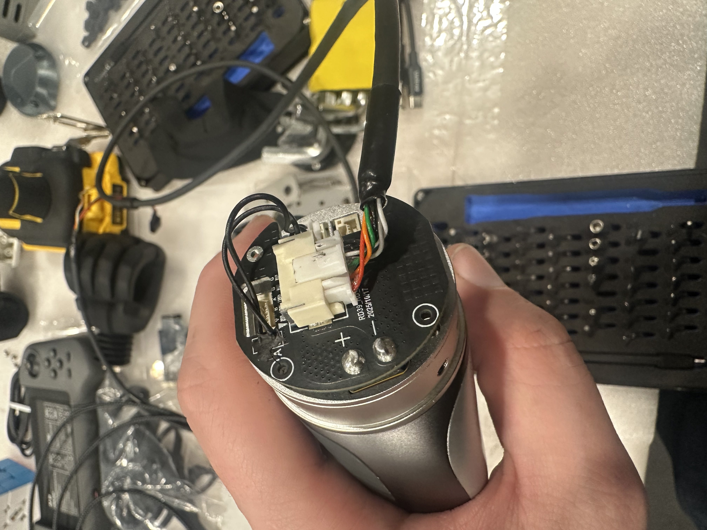
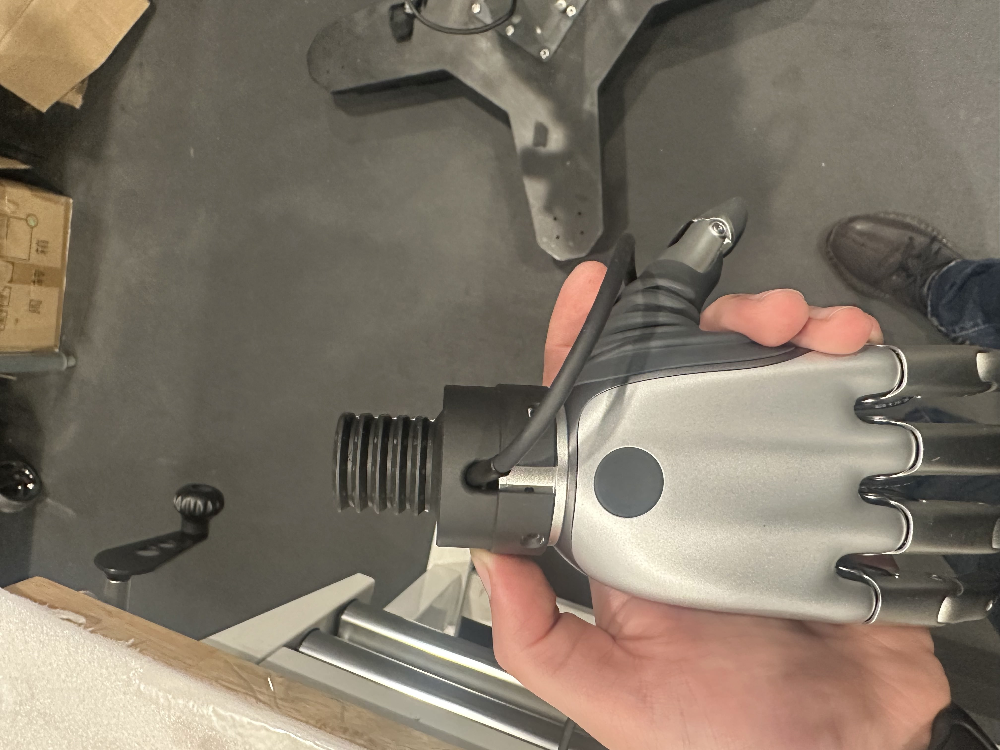
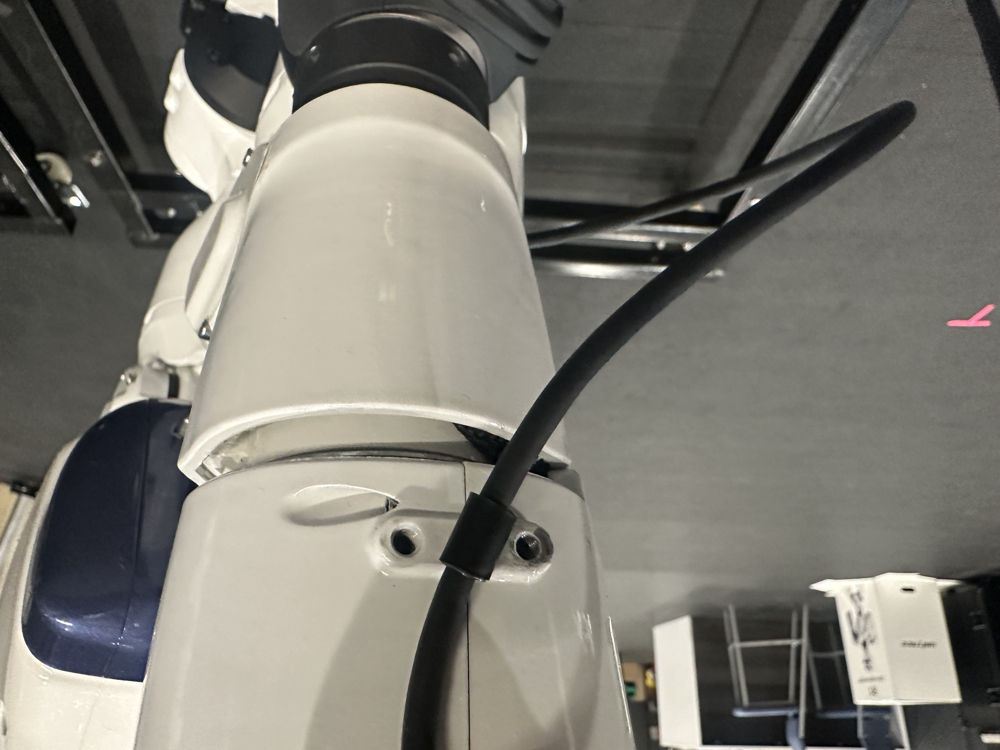
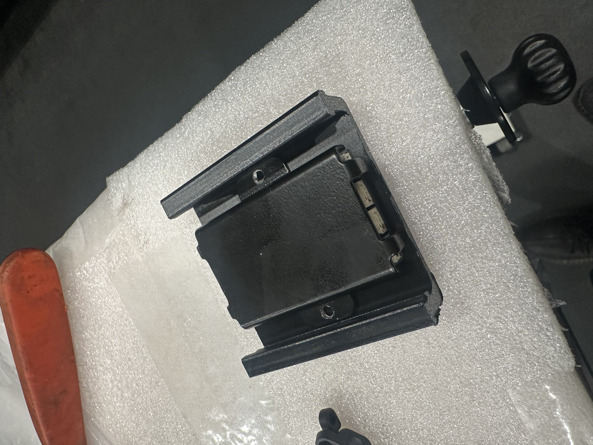
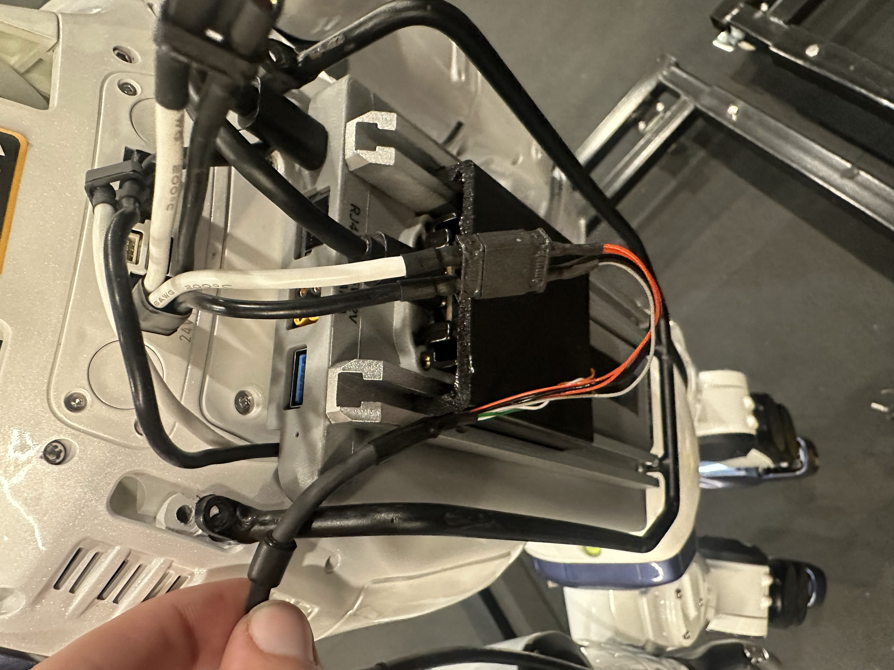

# Hacking BrainCo Revo2 Dexterous Hands onto a Unitree R1 from PC2

> A complete hardware-and-software retrofit/build log for installing
> BrainCo Revo2 dexterous hands on a Unitree R1 and bringing them to
> life through the robot's PC2 computer.

## The Retrofit

This build log documents the complete retrofit: removing the original
Unitree R1 hands, installing and wiring the BrainCo Revo2 hands, fitting
custom 3D-printed wrist and PCB mounts, routing the wiring, connecting
24 V power and USB, and then configuring the existing BrainCo/Unitree
software on PC2.

Once everything was working, the complete path looked roughly like this:

``` text
BrainCo Revo2 Hands
        │
        ├── Custom 3D-Printed Wrist Mounts
        │
        ├── Revo2 Wiring
        │
        └── 24 V Power
              │
              └── Power Splitter

Revo2 Wiring / Connector
        │
        └── Interface PCB
              │
              ├── Custom 3D-Printed PCB Mount
              └── USB
                    │
                    ▼
              Unitree R1 PC2
                    │
                    ▼
          brainco_hand_server
                    │
                    ▼
               Unitree DDS
              /           \
             ▼             ▼
     Left Hand Topics   Right Hand Topics
```

> **Important:** This documents one specific Unitree R1 + BrainCo Revo2
> retrofit. Verify wiring, voltage, polarity, connectors, serial
> devices, network interfaces, and mechanical clearances on your own
> hardware before applying power or commanding motion.

------------------------------------------------------------------------

# Part I --- Hardware Installation

## Hardware Overview

The physical retrofit was completed in six main steps:

1.  Remove the original Unitree R1 hands.
2.  Attach the BrainCo Revo2 wiring.
3.  Install the custom 3D-printed wrist mounts.
4.  Route the Revo2 wiring and connectors to the top of the robot.
5.  Attach the interface PCB to the custom 3D-printed PCB mount.
6.  Connect the hands to 24 V through the splitter and connect the PCB
    to PC2 over USB.

### Files and Images

This README assumes a repository layout similar to:

``` text
.
├── README.md
├── hardware/
│   ├── wrist-mount.stl
│   └── pcb-mount.stl
└── images/
    ├── 01-remove-original-hands.jpg
    ├── 02-revo2-wiring.jpg
    ├── 03-wrist-mount.jpg
    ├── 04-wire-routing.jpg
    ├── 05-pcb-mount.jpg
    ├── 06-power-usb.jpg
    └── 07-completed-retrofit.jpg
```

Change the filenames and image paths to match your actual repository.

------------------------------------------------------------------------

## 1. Remove the Original Unitree R1 Hands

Start by removing the original hands from the Unitree R1.

This exposes the wrist area and gives access to the mounting location
needed for the BrainCo Revo2 retrofit.

Before continuing, make sure the robot is powered down and that the
wrist area is accessible.


------------------------------------------------------------------------

## 2. Attach the BrainCo Revo2 Wiring

With the original hands removed, attach the BrainCo Revo2 wiring.

Doing the wiring at this stage keeps the connectors accessible before
the custom wrist mount and Revo2 hand assembly are fully installed.

Make sure the wiring is seated correctly and positioned so it will not
be pinched when the wrist mount is attached.



------------------------------------------------------------------------

## 3. Install the 3D-Printed Wrist Mount

Next, install the custom 3D-printed wrist mount.

The wrist mount acts as the mechanical interface between the Unitree R1
wrist and the BrainCo Revo2 hand assembly.

The STL used for this retrofit is stored in the repository:

``` text
hardware/wrist-mount.stl
```

> Replace `wrist-mount.stl` with the actual STL filename.

Position the mount correctly, make sure the Revo2 wiring remains
accessible, and secure the mount to the wrist.

Before moving on, check that:

-   The mount is seated correctly.
-   The wiring is not trapped between printed and robot parts.
-   The hand has sufficient clearance.
-   Nothing interferes with wrist motion.



------------------------------------------------------------------------

## 4. Route the Revo2 Wiring to the Top of the Robot

After the wrist hardware is installed, route the Revo2 wiring and
connector upward toward the top of the robot.

The goal is to bring the hand connections to the location where the
interface PCB will be mounted.

Keep the wiring:

-   Clear of moving joints.
-   Away from sharp edges.
-   Out of obvious pinch points.
-   Loose enough to allow normal joint movement.
-   Secure enough that it cannot fall into the mechanism.

Do not pull the wiring tight across an articulated joint. Leave enough
service loop for the robot's intended range of motion.



------------------------------------------------------------------------

## 5. Attach the PCB to the 3D-Printed PCB Mount

The interface PCB is mounted using a second custom 3D-printed part.

The STL for this mount is stored in the repository:

``` text
hardware/pcb-mount.stl
```

> Replace `pcb-mount.stl` with the actual STL filename.

Attach the PCB to the printed mount, then secure the PCB/mount assembly
at the top of the robot.

Make sure the board is mechanically secure and that its connectors
remain accessible for the hand wiring, power, and USB connection.



------------------------------------------------------------------------

## 6. Connect 24 V Power and USB

With the hands, wiring, and PCB installed, make the final electrical
connections.

### Hand Power

Connect the BrainCo hand power to **24 V through the splitter**.

``` text
24 V Supply
     │
     ▼
  Splitter
   /    \
  ▼      ▼
Left    Right
Hand    Hand
```

Before applying power, verify the connector orientation, voltage, and
polarity for the hardware being used.

### PCB USB Connection

Connect the USB cable from the interface PCB to the Unitree R1 PC2.

The complete hardware communication path is now:

``` text
BrainCo Revo2 Hands
        │
        ▼
Revo2 Wiring
        │
        ▼
Interface PCB
        │
       USB
        │
        ▼
Unitree R1 PC2
```



------------------------------------------------------------------------

## 7. Completed Hardware Retrofit

At this point:

-   The original R1 hands have been removed.
-   BrainCo Revo2 wiring has been installed.
-   The custom wrist mounts are installed.
-   The wiring has been routed to the top.
-   The PCB is secured to its custom printed mount.
-   Hand power is connected to 24 V through the splitter.
-   The PCB is connected to PC2 over USB.


The next step is to move to PC2 and verify that Linux can actually see
the newly connected hand interface.

------------------------------------------------------------------------

# Part II --- Software Setup and Control

## DDS Topics

The BrainCo service creates separate DDS command and state topics for
the left and right hands:

``` text
rt/brainco/left/cmd
rt/brainco/left/state
rt/brainco/right/cmd
rt/brainco/right/state
```

Each hand exposes six normalized controls:

    Index Control
  ------- -----------------
        0 Thumb
        1 Thumb auxiliary
        2 Index
        3 Middle
        4 Ring
        5 Pinky

Finger position and speed are represented on a normalized `0.0–1.0`
scale.

------------------------------------------------------------------------

## 8. Get Inside the R1: SSH into PC2

The software work was performed directly on the R1's PC2 computer over
SSH.

Once connected, the shell looked like:

``` bash
unitree@ubuntu:~$
```

Before hacking on the hand-control software, first make sure Linux can
actually see the hand interface.

------------------------------------------------------------------------

## 9. First Check: Can PC2 See the Hands?

``` bash
ls -l /dev/ttyUSB*
```

Initially this returned:

``` text
ls: cannot access '/dev/ttyUSB*': No such file or directory
```

Also check both common Linux USB serial device types:

``` bash
ls -l /dev/ttyACM* /dev/ttyUSB* 2>/dev/null
```

Nothing appeared.

At that point, the problem was clearly below the SDK/application layer.
There was no point modifying BrainCo software until Linux could actually
detect the hardware.

------------------------------------------------------------------------

## 10. Trace the Hardware at the USB Level

Run:

``` bash
lsusb
```

Initially PC2 only reported its root hubs:

``` text
Bus 002 Device 001: ID 1d6b:0003 Linux Foundation 3.0 root hub
Bus 001 Device 001: ID 1d6b:0002 Linux Foundation 2.0 root hub
```

After reconnecting the hand interface, `lsusb` showed:

``` text
Bus 001 Device 004: ID 0403:6011 Future Technology Devices International, Ltd FT4232H Quad HS USB-UART/FIFO IC
```

This was the first real breakthrough on the software side of the
retrofit.

PC2 was seeing an **FTDI FT4232H Quad HS USB-UART/FIFO**.

The kernel recognized it and created four serial interfaces:

``` text
/dev/ttyUSB0
/dev/ttyUSB1
/dev/ttyUSB2
/dev/ttyUSB3
```

The FT4232H is a four-channel device, which explains why one physical
USB device produced four `/dev/ttyUSB` entries.

Confirm:

``` bash
ls -l /dev/ttyUSB*
```

Output:

``` text
crw-rw---- 1 root dialout 188, 0 /dev/ttyUSB0
crw-rw---- 1 root dialout 188, 1 /dev/ttyUSB1
crw-rw---- 1 root dialout 188, 2 /dev/ttyUSB2
crw-rw---- 1 root dialout 188, 3 /dev/ttyUSB3
```

Another useful command is:

``` bash
sudo dmesg -w
```

Leave it running while unplugging and reconnecting the USB interface.
Linux should enumerate the FTDI device and attach the individual serial
interfaces.

------------------------------------------------------------------------

## 11. Unlock Serial-Port Access for the `unitree` User

The serial interfaces showed:

``` text
root dialout
```

Members of the Linux `dialout` group can access these serial interfaces.

Check:

``` bash
groups
```

Originally, the `unitree` account was not a member of `dialout`.

Add it:

``` bash
sudo usermod -aG dialout unitree
```

Disconnect the SSH session and reconnect, then check again:

``` bash
groups
```

The account then included:

``` text
unitree adm dialout cdrom sudo audio dip video plugdev render i2c lpadmin gdm sambashare weston-launch gpio
```

At this point the `unitree` account could access `/dev/ttyUSB0` through
`/dev/ttyUSB3` without manually changing serial-device permissions.

------------------------------------------------------------------------

## 12. Dig Through PC2 for Existing BrainCo Code

Before installing anything new, search the existing PC2 filesystem:

``` bash
find ~ -maxdepth 4 -type d \( -iname "*brainco*" -o -iname "*revo*" -o -iname "*stark*" \) 2>/dev/null
```

This R1 already had BrainCo software on PC2.

Important directories:

``` text
/home/unitree/stark-serialport-example
/home/unitree/brainco_hand_service
```

The Stark examples included:

``` text
~/stark-serialport-example/python/revo2
~/stark-serialport-example/python/revo2_tactile_grasp
~/stark-serialport-example/python/revo2_can
~/stark-serialport-example/python/revo2_canfd
~/stark-serialport-example/linux/revo2
```

There were also Revo1 and EtherCAT examples.

Before cloning another SDK or building a new stack, check what is
already installed on the robot.

------------------------------------------------------------------------

## 13. Find Unitree's BrainCo Hand Bridge

``` bash
cd ~/brainco_hand_service
```

This directory contained the source code for the Unitree/BrainCo DDS
bridge.

Prebuilt executables:

``` text
~/brainco_hand_service/bin/
```

Check:

``` bash
ls -l ~/brainco_hand_service/bin
```

Our installation contained:

``` text
brainco_hand_server
test_brainco_hand_server
```

The first executable is the serial-to-DDS hand service. The second is a
prebuilt example client that publishes commands to the service.

  ------------------------------------------------------------------------------------------------
  Purpose                             Path
  ----------------------------------- ------------------------------------------------------------
  Main service source                 `~/brainco_hand_service/main.cpp`

  Test client source                  `~/brainco_hand_service/test/test_brainco_hand_server.cpp`

  Build directory                     `~/brainco_hand_service/build/`

  Service executable                  `~/brainco_hand_service/bin/brainco_hand_server`

  Test executable                     `~/brainco_hand_service/bin/test_brainco_hand_server`
  ------------------------------------------------------------------------------------------------

------------------------------------------------------------------------

## 14. Decode the Hand IDs and Serial Settings

Looking at `main.cpp` showed:

``` cpp
constexpr uint8_t L_id = 0x7e;
constexpr uint8_t R_id = 0x7f;
constexpr uint32_t baudrate = 460800;
```

  Setting      Value
  ------------ ----------------
  Left hand    `0x7E` / `126`
  Right hand   `0x7F` / `127`
  Baud rate    `460800`

The service initializes the BrainCo Revo2 hardware using Modbus:

``` cpp
init_cfg(
    StarkHardwareType::STARK_HARDWARE_TYPE_REVO2_BASIC,
    StarkProtocolType::STARK_PROTOCOL_TYPE_MODBUS,
    LogLevel::LOG_LEVEL_ERROR,
    1024
);
```

It then opens a serial connection and requests device information:

``` cpp
DeviceHandler* handle = modbus_open(port.c_str(), baudrate);
DeviceInfo* info = modbus_get_device_info(handle, slave_id);
```

The service can therefore query the connected device instead of simply
assuming that a serial port corresponds to a particular hand.

------------------------------------------------------------------------

## 15. The Key Hack: Fix the Serial-Port Mismatch

The supplied `main.cpp` was looking for:

``` text
/dev/ttyCH343USB0
/dev/ttyCH343USB1
```

But the FTDI interface on this R1 created:

``` text
/dev/ttyUSB0
/dev/ttyUSB1
/dev/ttyUSB2
/dev/ttyUSB3
```

The original section was:

``` cpp
if (path.rfind("/dev/ttyCH343USB0", 0) == 0)
    ports.push_back(path);

if (path.rfind("/dev/ttyCH343USB1", 0) == 0)
    ports.push_back(path);
```

For this R1, change it to:

``` cpp
if (path.rfind("/dev/ttyUSB", 0) == 0)
    ports.push_back(path);
```

That lets the service discover and probe the FT4232H serial interfaces.

> This is hardware/configuration-specific. Do not automatically make the
> same change on every R1.

First check:

``` bash
ls -l /dev/ttyUSB*
ls -l /dev/ttyCH343USB*
```

------------------------------------------------------------------------

## 16. Patch the Source Directly on PC2

This PC2 image did not have `nano`:

``` text
-bash: nano: command not found
```

`vi` was available:

``` bash
cd ~/brainco_hand_service
vi main.cpp
```

Make the serial-port change and save the file.

------------------------------------------------------------------------

## 17. Rebuild the Modified BrainCo Service

``` bash
cd ~/brainco_hand_service/build
make -j6
```

A successful build looked like:

``` text
Scanning dependencies of target brainco_hand_server
[ 25%] Building CXX object CMakeFiles/brainco_hand_server.dir/main.cpp.o
[ 75%] Built target test_brainco_hand_server
[100%] Linking CXX executable ../bin/brainco_hand_server
[100%] Built target brainco_hand_server
```

The executable is generated at:

``` text
~/brainco_hand_service/bin/brainco_hand_server
```

------------------------------------------------------------------------

## 18. Find the R1's Actual DDS Network Interface

Run:

``` bash
ip -br link
```

Our R1 PC2 showed:

``` text
lo       UNKNOWN
dummy0   DOWN
eth10    UP
docker0  DOWN
```

The relevant interface was:

``` text
eth10 UP
```

The repository README uses `eth0` as an example, but this R1 used
`eth10`.

Check the actual robot instead of assuming the interface name.

------------------------------------------------------------------------

## 19. Bring the Serial-to-DDS Bridge Online

The executable is not in the repository root, so this will fail:

``` bash
cd ~/brainco_hand_service
sudo ./brainco_hand_server
```

Instead:

``` bash
cd ~/brainco_hand_service/bin
sudo ./brainco_hand_server --network eth10
```

The modified service now acts as the bridge:

``` text
BrainCo Revo2 Hands
        ↓
Serial / Interface PCB
        ↓
brainco_hand_server
        ↓
Unitree DDS
        ↓
rt/brainco/left/...
rt/brainco/right/...
```

Keep this process running and use a separate terminal for control
commands.

------------------------------------------------------------------------

## 20. Make the Hands Move with Unitree's Built-In Test

The built-in test executable is:

``` text
~/brainco_hand_service/bin/test_brainco_hand_server
```

Its source is:

``` text
~/brainco_hand_service/test/test_brainco_hand_server.cpp
```

It publishes to:

``` text
rt/brainco/left/cmd
```

or:

``` text
rt/brainco/right/cmd
```

Test the left hand:

``` bash
cd ~/brainco_hand_service/bin
sudo ./test_brainco_hand_server left
```

Test the right:

``` bash
sudo ./test_brainco_hand_server right
```

The stock test cycles through:

``` cpp
positions = {0, 0, 0, 0, 0, 0};
```

then:

``` cpp
positions = {0, 1, 1, 1, 1, 1};
```

then:

``` cpp
positions = {1, 1, 1, 1, 1, 1};
```

with delays between commands.

This confirmed that all six hand DOFs could be commanded through DDS.

------------------------------------------------------------------------

## 21. Why the First Two-Hand Command Doesn't Work

This does **not** run both hands:

``` bash
sudo ./test_brainco_hand_server left && right
```

In Bash, `&&` runs the next shell command only after the previous
command exits successfully. Bash therefore interprets `right` as another
executable.

Likewise:

``` bash
sudo ./test_brainco_hand_server left &&
sudo ./test_brainco_hand_server right
```

runs them sequentially rather than simultaneously.

------------------------------------------------------------------------

## 22. Get Both BrainCo Hands Moving at the Same Time

Run both test programs concurrently:

``` bash
cd ~/brainco_hand_service/bin

sudo ./test_brainco_hand_server left &
sudo ./test_brainco_hand_server right &
wait
```

The `&` backgrounds each process.

``` text
                    brainco_hand_server
                            │
              ┌─────────────┴─────────────┐
              │                           │
   rt/brainco/left/cmd          rt/brainco/right/cmd
              ↑                           ↑
      left test process             right test process
```

Stop the test processes with:

``` bash
sudo pkill -f test_brainco_hand_server
```

------------------------------------------------------------------------

## 23. Hack the Test Client for Individual Finger Control

The six-element array corresponds to:

``` text
[Thumb, Thumb_aux, Index, Middle, Ring, Pinky]
```

  Finger              Array Element
  ----------------- ---------------
  Thumb                           0
  Thumb auxiliary                 1
  Index                           2
  Middle                          3
  Ring                            4
  Pinky                           5

For example:

``` cpp
positions[2] = 1.0f;
```

changes the requested index-finger position.

This:

``` cpp
cmds()[2].q() = 1.0;
```

cannot be entered directly into Bash because it is C++ source code.

Modify:

``` text
~/brainco_hand_service/test/test_brainco_hand_server.cpp
```

and rebuild it.

------------------------------------------------------------------------

## 24. Build a Safer Single-Finger Test

For individual-finger testing, read the current hand state first and
preserve the other five positions.

State topics:

``` text
rt/brainco/left/state
rt/brainco/right/state
```

Read the current positions:

``` cpp
std::array<float, 6> positions;

for (int i = 0; i < 6; ++i)
{
    positions[i] = lowstate->msg_.states()[i].q();
}
```

Change only the index:

``` cpp
positions[2] = 1.0f;
```

Publish:

``` cpp
for (int i = 0; i < 6; ++i)
{
    lowcmd->msg_.cmds()[i].q() = positions[i];
}

lowcmd->unlockAndPublish();
```

Then send the opposite endpoint:

``` cpp
positions[2] = 0.0f;
```

For initial testing, finger speed was reduced from:

``` cpp
finger.dq() = 1.0f;
```

to:

``` cpp
finger.dq() = 0.3f;
```

so the first experimental movement could be slower.

------------------------------------------------------------------------

## 25. Rebuild and Run the Modified Test

After modifying:

``` text
~/brainco_hand_service/test/test_brainco_hand_server.cpp
```

recompile:

``` bash
cd ~/brainco_hand_service/build
make -j6
```

Then:

``` bash
cd ~/brainco_hand_service/bin
sudo ./test_brainco_hand_server left
```

or:

``` bash
sudo ./test_brainco_hand_server right
```

------------------------------------------------------------------------

# File and Directory Reference

  ------------------------------------------------------------------------------------------------
  Item                                Location
  ----------------------------------- ------------------------------------------------------------
  BrainCo/Unitree service             `~/brainco_hand_service/`

  Main serial-to-DDS source           `~/brainco_hand_service/main.cpp`

  Service executable                  `~/brainco_hand_service/bin/brainco_hand_server`

  Control/test source                 `~/brainco_hand_service/test/test_brainco_hand_server.cpp`

  Control/test executable             `~/brainco_hand_service/bin/test_brainco_hand_server`

  Build directory                     `~/brainco_hand_service/build/`

  Additional BrainCo/Stark examples   `~/stark-serialport-example/`

  Python Revo2 examples               `~/stark-serialport-example/python/revo2/`

  Linux Revo2 examples                `~/stark-serialport-example/linux/revo2/`

  Custom wrist mount                  `hardware/wrist-mount.stl`

  Custom PCB mount                    `hardware/pcb-mount.stl`
  ------------------------------------------------------------------------------------------------

------------------------------------------------------------------------

# Quick Command Reference

### Check USB hardware

``` bash
lsusb
```

### Check serial interfaces

``` bash
ls -l /dev/ttyUSB*
```

### Watch USB connections

``` bash
sudo dmesg -w
```

### Check serial permissions

``` bash
groups
```

### Add `unitree` to `dialout`

``` bash
sudo usermod -aG dialout unitree
```

Reconnect SSH afterward.

### Find existing BrainCo software

``` bash
find ~ -maxdepth 4 -type d \( -iname "*brainco*" -o -iname "*revo*" -o -iname "*stark*" \) 2>/dev/null
```

### Check network interfaces

``` bash
ip -br link
```

### Build

``` bash
cd ~/brainco_hand_service/build
make -j6
```

### Start the server on this R1

``` bash
cd ~/brainco_hand_service/bin
sudo ./brainco_hand_server --network eth10
```

### Test left

``` bash
sudo ./test_brainco_hand_server left
```

### Test right

``` bash
sudo ./test_brainco_hand_server right
```

### Test both

``` bash
sudo ./test_brainco_hand_server left &
sudo ./test_brainco_hand_server right &
wait
```

### Stop tests

``` bash
sudo pkill -f test_brainco_hand_server
```

------------------------------------------------------------------------

# What We Learned

The complete retrofit path was:

``` text
Remove original R1 hands
        ↓
Attach BrainCo Revo2 wiring
        ↓
Install 3D-printed wrist mounts
        ↓
Route wiring and connectors upward
        ↓
Mount interface PCB on 3D-printed PCB mount
        ↓
Connect hand power to 24 V through splitter
        ↓
Connect PCB USB to PC2
        ↓
No /dev/ttyUSB devices
        ↓
Check lsusb
        ↓
Reconnect USB interface
        ↓
FTDI FT4232H detected
        ↓
ttyUSB0–ttyUSB3 created
        ↓
Fix dialout permissions
        ↓
Find existing BrainCo software
        ↓
Discover serial-device naming mismatch
        ↓
Rebuild brainco_hand_server
        ↓
Use correct PC2 network interface
        ↓
Start serial-to-DDS bridge
        ↓
Use existing Unitree test client
        ↓
Control left/right BrainCo hands
        ↓
Extend example for individual fingers
```

One of the biggest lessons was that a completely new software stack was
not necessary. PC2 already contained BrainCo/Stark examples and
Unitree's `brainco_hand_service`, including prebuilt binaries.

The key was connecting the physical retrofit correctly, identifying the
actual USB hardware, fixing Linux permissions, matching the
serial-device names used by the real interface, selecting the correct
DDS network interface, and then using the software that was already
present.

------------------------------------------------------------------------

# Safety and Modification Note

This project documents one specific Unitree R1 + BrainCo Revo2
installation. Serial-device names, network interfaces, hand models,
firmware, printed mounts, wiring, connectors, and electrical
configuration may differ on another robot.

Before applying power or issuing motion commands:

-   Power down the robot while making physical or electrical changes.
-   Verify the required supply voltage, connector orientation, and
    polarity before connecting the 24 V supply.
-   Keep wiring clear of joints and pinch points.
-   Verify that 3D-printed mounts are mechanically secure.
-   Check wrist and arm clearance before enabling motion.
-   Keep hands and objects clear of the Revo2 fingers.
-   Verify which physical hand is being addressed.
-   Begin at reduced finger speed.
-   Do not assume normalized endpoints correspond to the same physical
    direction on every configuration.
-   For custom behaviors, read the current hand state and modify only
    the intended DOF rather than blindly commanding all six finger
    positions.

------------------------------------------------------------------------

# Project Summary

  Component                       Configuration
  ------------------------------- ------------------------------------
  Robot                           Unitree R1
  Hands                           BrainCo Revo2
  Computer                        Unitree R1 PC2
  Mechanical interface            Custom 3D-printed wrist mount
  PCB mounting                    Custom 3D-printed PCB mount
  Hand power                      24 V through splitter
  PC2 connection                  USB from interface PCB
  USB interface detected by PC2   FTDI FT4232H Quad HS USB-UART/FIFO
  Protocol                        Modbus
  Baud rate                       `460800`
  Left hand ID                    `0x7E` / `126`
  Right hand ID                   `0x7F` / `127`
  DDS interface on this R1        `eth10`

## DDS Topics

``` text
rt/brainco/left/cmd
rt/brainco/left/state
rt/brainco/right/cmd
rt/brainco/right/state
```

------------------------------------------------------------------------

*This README documents an experimental hardware/software retrofit and is
not an official Unitree or BrainCo integration.*
